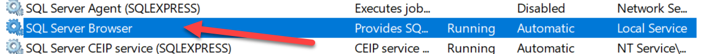
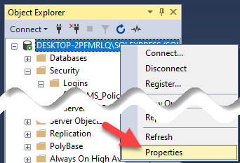
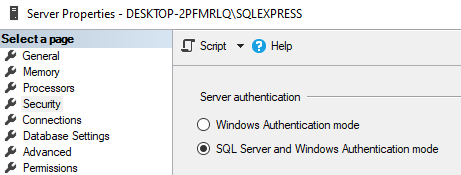
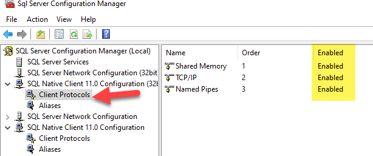
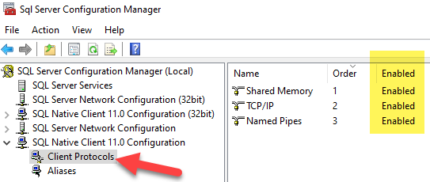

# Sql Server Convfiguration

SQL Server will need to be configured to allow for Named Pipes and to allow SQL Server accounts to be used to log into the Database.

## SQL Server Browser Service Setup

The SQL Servier Browser should start automicatically with windows and be running at all times.

1. Use the Run window to start Services (all Windows versions)

2. Press the **Win + R** keys on your keyboard, to open the Run window.

3. Then, type "services.msc" and hit Enter or press OK.

4. Then find SQL Server Browser and make sure it is set to 'Automatic' and is 'Running'
   

## Set up Authentication with SQL Server Accounts

1. Open Microsoft SQL Server Management Studio.

2. Right click the SQL Server in the Object explorer and select Properties  
   (_If SQL Server Management Studio does not show in your application list, it is located at "**C:\Windows\SysWOW64\SQLServerManager15.msc**"_)

    

3. Then go to 'Security' and update the 'Server Authentication' to be 'SQL Server and Windows Authentication mode'

    

## Enable SQL Server Client Protocols

1. Now open the 'Sql Server Configuration Manager'.

2. Enable all client protocals for 32 and 64 bit clients:

### SQL Nataive Client 11.0 Confifuration (32bit client) 

### SQL Nataive Client 11.0 Confifuration (64bit client) 

