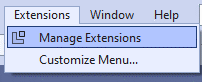
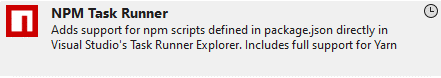

# Configure Visual Studio

The following Templates, Tools, and Extensions should be installed

## Install the Optimizely Templates

From Powershell run the following command:

```bash
dotnet new -i EPiServer.Net.Templates --nuget-source https://nuget.optimizely.com/feed/packages.svc/ --force
```

## Install the Optimizely CLI Tool

From Powershell run the following command:

```bash
dotnet tool install EPiServer.Net.Cli --global --add-source https://nuget.optimizely.com/feed/packages.svc/
```

## Intall the NPM Task Runner Visual Studio Extension

The NPM Task Runner is used to run the front end build tasks when the solution is built.

1) Open the Extensions tab in Visual Studio and select Manage Extensions <br>


2) Search for and download the NPM Task Runner <br>

