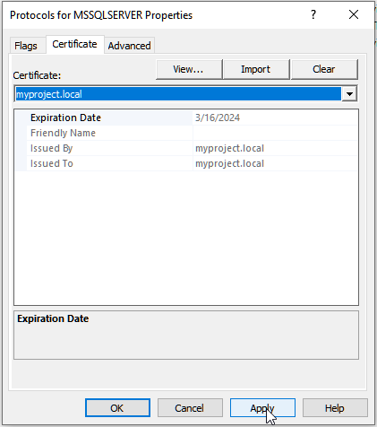
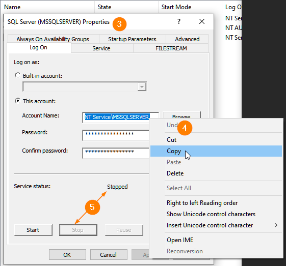
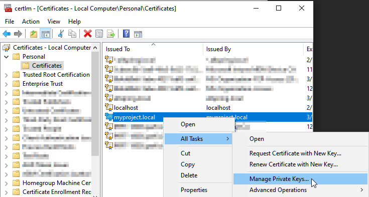
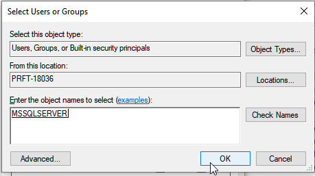
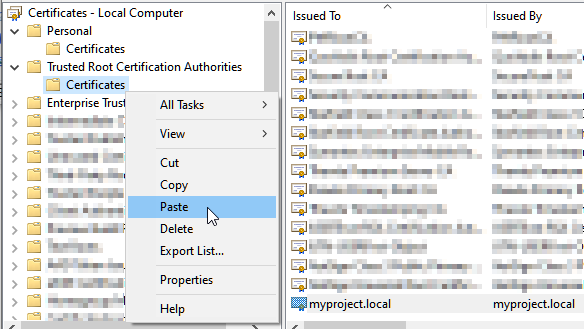
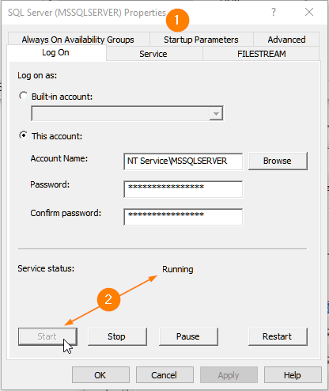

# Configuring SQL Server for HTTPS

For the following processes, open **SQL Server Configuration Manager** on your machine.

## Assign the local certificate to SQL Server

1. In **SQL Server Configuration Manager**, expand **SQL Server Network Configuration** on the left side

2. Right-click on **Protocols for MSSQLSERVER**

3. Select **Properties**

4. Go to the **Certificate** tab

5. Using the Certificate dropdown, find the certificate matching your **subject** or **dnsname**

6. Click **Apply**

## Grant Permissions

1. In **SQL Server Configuration Manager**, select **SQL Server Services** on the left side

2. Right click on the row with the name "**SQL Server (MSSQLSERVER)**"

3. Select **Properties**

4. Highlight the value in the **Account Name** field and copy it

5. Click the **Stop** button at the bottom **but leave this dialog open**

    

6. Open the Windows Run dialog (**Win+R**)

7. Type "**certlm.msc**" and hit Enter or click OK

8. Expand **Personal** on the left tree

9. Click on **Certificates**

10. Right click on your newly created certificate

11. Choose **All Tasks > Manage Private Keys...**

    

12. Click the **Add...** button

13. Ensure the "**From this location:**" box is your local machine. If not click the **Locations...** button and select your machine

14. Paste the copied **Account Name** from step 4 into the "**Enter the object names**" box (_a typical value is "NT Service\MSSQLSERVER"_)

15. Click **Check Names** to resolve the name

16. Click **OK**

    

17. Ensure **Full Control** is checked

18. Click **OK**

&nbsp;

### Adding a trusted local certificate

1. Still within the **Certificate Manager** from the previous steps, expand **Personal** on the left tree

2. Click on **Certificates**

3. Right click on your newly created certificate

4. Select **Copy**

    

5. Expand **Trusted Root Certification Authorities** on the left tree

6. Right-click on **Certificates**

7. Select **Paste**

    

8. You can close Certificate Manager now

&nbsp;

#### Start SQL Server

1. Navigate back to your **SQL Server Properties** dialog in **SQL Server Configuration Manager** (_see Grant Permissions step 5_)

2. Click the **Start** button

    

3. You can close SQL Server Configuration Manager now

&nbsp;
