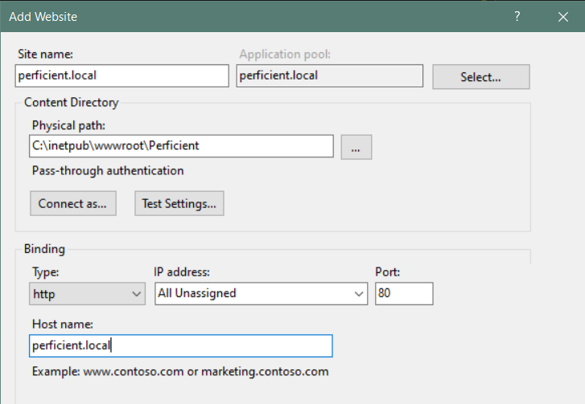

# IIS Setup

IIS can be set up locally to test and preview development with a local browser. IIS is a Web Server native to Windows, and can be enabled via Windows Features.

It is important to note that IIS reserves ports 80 (http) and 443 (https) by default, and any other ports specified in site bindings. This can cause conflicts if using it alongside Kestrel with .NET 6, so be sure to keep port assignments unique.

## Installing IIS

1. To install IIS find the 'Turn Windows features on or off' control panel. Then check that the following features have been enabled: 

2. Download and install the [ASP.NET Core 5.0 Runtime Hosting Bundle](https://dotnet.microsoft.com/en-us/download/dotnet/5.0) from the following site section: **ASP.NET Core Runtime > Windows > Hosting Bundle**

3. Create folder for the published code:

    1. Navigate to C:\windows\inetpub\wwwroot
    2. Create the following 'Perficient'

4. Open IIS Manager, by going to Windows > Run and running the command: **InetMgr.exe**

5. When IIS Manager is open, right-click 'Sites' and select 'Add Website'.

6. Fill in the form to setup the new website:

    **Site Name:** perficient.local  
    **Physical Path:** C:\inetpub\wwwroot\Perficient  
    **Host Name:** perficient.local

    

7. Update the applications pool
    1. In IIS Manager navigate to the Application Pools
    2. Double click the application pool for perficient.local
    3. Set the .NET CLR version to 'No Managed Code'
