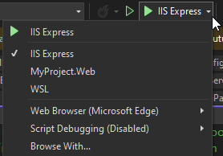

# Kestral Setup

## Kestrel Overview

Kestrel is a new addition to .NET 6. It is a cross-platform web server for .NET Core projects and is included and enabled, by default, in .NET Core projects.

Visual Studio has native support to run an application using the Kestrel web server for debugging instead of using IIS Express, or requiring publishing to an IIS hosted web folder. Additionally, the Kestrel web server has the ability to reserve multiple ports, and respond to multiple hostnames for a single application.

## Configuring Launch Settings

The **launchSettings.json** file is located in the Web project root under the Properties folder. This configuration file is used to configure launch profiles for .NET applications in Visual Studio.

1. Open the **launchSettings.json** file

2. Identify the "**Profiles**" settings element. By default an "**IIS Express**" profile entry should exist.

3. Add or update the current named for your project matching the following template:

    ```json
    "Perficient.Web":{
        "commandName": "Project",
        "launchBrowser": true,
        "launchUrl": "http://perficient.local:4431/episerver/cms",
        "externalUrlConfiguration": true,
        "environmentVariables": {
            "ASPNETCORE_ENVIRONMENT": "Development"
        }
    }
    ```

4. Save the file and check the launch debugging menu on the toolbar. Clicking the down arrow should reveal a new "**Perfcient.Web**" option.

