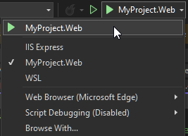

# Run the application in Kestral

At this point you can run your application with the localhost Urls using Kestrel through Visual Studio.

1. Click the arrow on the launch debugging menu and select your project profile.

2. Click the Run arrow

