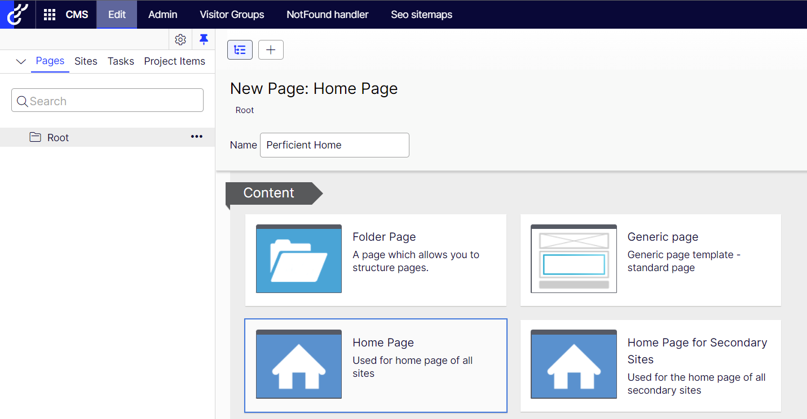

# Setting up the Site - Logging in for the first time

1. Start your site from Visual Studio.  **[See Configure Launch Settings](./KestrelRun.md)** to review how to launch your site from Kestral

2. Browse the Url http://perficent.local/Episerver/Cms to verify that Episerver is Up and Running

3. After validating that the site starts, copy your Episerver License file into {BaseDirectory}\Site\wwwroot\ 

4. Restart the site and Browse to the Login page again.

5. For the local environments, The Admin2 user account will be created automatically. Login with the following credentials:

**Username:** Admin2  
**Password:** Pass@word1

&nbsp;

## Create the Home Page

1. Log Into Episerver with the Admin user

2. Browse the Url http://perficent.local/Episerver/Cms

3. Select CMS from the Waffle menu at the top right-click

4. Select the Edit Tab

5. Left Click the Root and Select Add Page

6. Add a Home Page - **Name:** Perficient Home

    

7. Publish this page

&nbsp;

## Configure the site

1. Click the Admin Tab

2. Click the Config sub tab

3. Select the Manage Web Site menu item

4. Click the Create Website Button

    **Name:** Perficient Local  
    **Url:** http://perficent.local:5001/  
    **Start Page:** Select the start page previously created

5. Add a Host Name to the site

6. Click the Add Host button in the Host Names section  
   **Host Name:** perficient.local  
   **Culture:** en  
   **Type:** Primary  
   **Scheme:** HTTP

    

7. Click Save Website

8. Run Kestreal and browse to http://perficent.local:5001/ to verify the Start Page is rendered
